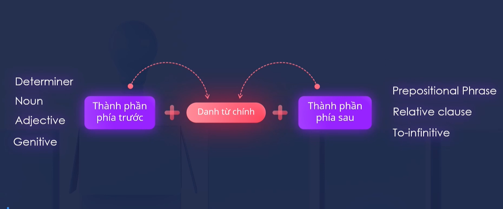

# Noun Phrase

` Thành phần phía trước -> Danh từ <- Thành phần phía sau `

VD:

```
a handsome man
a funny man
a very handsome man

very ( adverb ) -> handsome ( adj ) -> man ( noun )
```

```
a very handsome man who is coaching the Vietnamese footbal team

man <- who is coaching the Vietnamese footbal team ( relative clause )
```

```
a very handsome man from South Korea

man <- from South Korea ( Prepositional phrase )
```

```
a very handsome man to admire

man <- to admire ( To-infinitive )
```

- Performance evaluation
> Performance -> evaluation

- Registration form
> Registration => form

---

## Possessive ‘s - Sở hữu cách

` Noun 1 's Noun 2 `

VD:
- Mr. Holden's company
- The phone's features

## Summary
