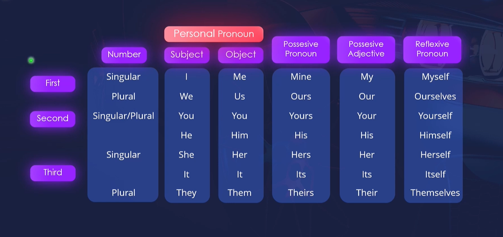

# Các từ loại cơ bản

## Noun
- Concrete noun - danh từ cụ thể
- Abtract noun - danh từ trừu tượng
- Proper noun - danh từ riêng
- Countable - danh từ đếm được
- Uncountable - danh từ không đếm được

## Determiner - hạn định từ
- Article - mạo từ
- Demonstratives - hạn định từ chỉ định
- Possessive determiner - hạn định từ sở hữu
- Quantifiers - định lượng từ

### Article - a/an/the

VD:
- I want to visit `the` Eiffel tower
- Can you hand me `the` red pen ?
- I just bought some flowers. Can you put the flowers in a vase ?

#### Singular countable noun

VD:
- I want to eat an apple
- There is a cat in the yard
- 

#### Uncountable noun 

VD:
- We all need money to live
- Oranges are high in vitamin C 

### Demonstratives

#### This / These

VD:
- I will take this shirt
- I want to try these shoes on

#### That / Those

VD:
- I will take that shirt
- I want to try those shoes on

### Possessive determiner

` my your her his its their our `

VD:
- `My` mom is very good at cooking 
- `Her` car is expensive
- `Our` house is across the street

### Quantifiers

` some little many much `

VD:
- I don't have `any` money
- she has `a lot of` money

> much đi kèm với danh từ không đếm được

---

## Adjective - Tính từ

VD:
- A `good` manager
- A `bad` manager
- My manager is `smart`
- My manager looks `attractive`

---

## Verb - Động từ

- Intransitive - Nội động từ
- Transitive -  Ngoại động từ
- Main verb - Động từ chính
- Action verb - Động từ hành động
- Linking verb - Động từ liên kết
- Helping verb - Trợ động từ

### Action verb

` run sing walk `

### Linking verb

VD:
- My manager `is` smart
- My manager `looks` silly
- You `look` beautiful
- He `seems` nice
- I `feel` good
- It `tastes` delicious
- Our discussions will `remain` private 
- It will `get` better
- He `became` a scientist

---

## Adverb

```
Adjective -> Noun
```
```
Adverb -> Adjective
       -> Verb
       -> Adverb
```

#### Frequency - Tần số

```
always
usually
often
sometimes
seldom
rarely
never
```

VD:
- James `always` gets to work on time
- The manager `seldom` visits the warehouse

#### Degree - Mức độ

```
extremely
very
really
almost
fairly
quite
rather
```

VD:
- H'hennie is `very` beautiful
> very -> beautiful
- He worked `extremely` diligently
> extremely -> diligently

#### Manner - Cách thức

```
quickly
slowly
carefuly
beautifully
easily
camly
loudly
```

VD:
- The secretary checked the package carefully
> carefully -> checked
- The guest is paitently waiting in the lobby
> paitently -> waiting

#### time - Thời gian

```
ago
yesterday
tomorrow
soon
lately
temporarily
before
```

#### Degree - Địa điểm

```
here
there
nearby
outside
inside
upstairs
downstairs
```

---

## Preposition

```
Preposition + Noun phrase           -> Preposition phrases
            + Gerund phrase         -> Preposition phrases
```

VD:
- See you `at` noon
- I'll meet you `in` the lobbly
- There is a cafe at the corner

---

## Pronouns

VD:
- Becky is my coworker
- `She` is very knowledgeable
- `She` graduated from Harvard university

### Personal pronoun



VD:
- Becky is very knowledgeable
> She is very knowledgeable
- Everybody admires Becky
> Everybody admires her